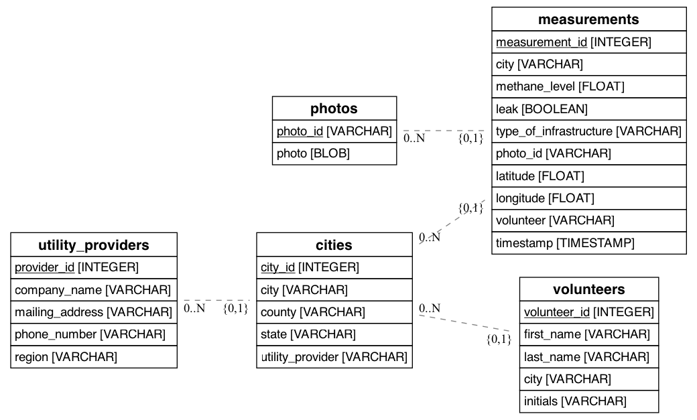
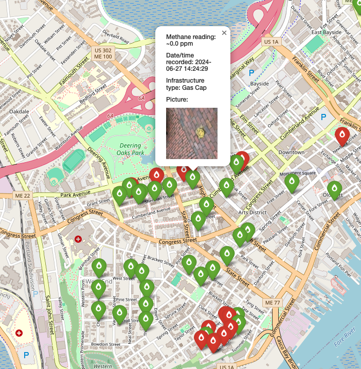

# Public Natural Gas Infrastructure Survey - Maine Cities

## Project Overview

This project aims to survey the public natural gas infrastructure across cities in Maine to document and map the locations of leaks. The project involves creating a database, extracting and transforming data collected by volunteers, and visualizing the results through interactive maps. These maps will help identify areas with potential gas leaks and support efforts to address environmental and public safety concerns.

## Table of Contents

- [Project Overview](#project-overview)
- [Goals](#goals)
- [Project Steps](#project-steps)
  - [1. Database Creation](#1-database-creation)
    - [Database Structure and Management](#database-structure-and-management)
  - [2. ETL Process](#2-etl-process)
  - [3. Leak Mapping](#3-leak-mapping)
- [Installation](#installation)
- [Usage](#usage)
- [File Structure](#file-structure)
- [License](#license)

## Goals

- **Survey public natural gas infrastructure** in Maine cities.
- **Document and map** the locations of leaks.
- **Provide visual insights** through interactive maps to help identify and address infrastructure issues.

## Project Steps

### 1. Database Creation

The first step in the project is to create a structured database to store the leak data collected by volunteers. This database will serve as the foundation for all subsequent data analysis and visualization tasks.

- **Technology Used:** SQLAlchemy for database management, SQLite as the database engine.
- **Tables:** The database includes tables for cities, utility providers, measurements, photos, and volunteers.

---

#### Database Structure and Management

The project uses a SQLite database to store and manage data related to leak measurements, including information about cities, utility providers, volunteers, and associated images. The database is managed through the `LeakDB` class, which is built using SQLAlchemy, an Object-Relational Mapping (ORM) tool that facilitates interactions with the database using Python objects.

Querying the database is best done via Make commands as described in the [Usage](#usage) section.

#### Database Tables



The database consists of the following key tables:

1. **Cities (`cities` table):**
   - Stores information about the cities in Maine where methane leak measurements are conducted.
   - **Columns:**
     - `city_id` (Integer, Primary Key, Auto-increment)
     - `city` (String, Unique)
     - `county` (String)
     - `state` (String, Default="MAINE")
     - `utility_provider` (String, Foreign Key to `utility_providers.company_name`)

2. **Utility Providers (`utility_providers` table):**
   - Stores information about the utility companies responsible for the natural gas infrastructure in various cities.
   - **Columns:**
     - `provider_id` (Integer, Primary Key)
     - `company_name` (String, Unique)
     - `mailing_address` (String)
     - `phone_number` (String)
     - `region` (String)

3. **Measurements (`measurements` table):**
   - Stores the methane leak measurements taken in various cities.
   - **Columns:**
     - `measurement_id` (Integer, Primary Key, Auto-increment)
     - `city` (String, Foreign Key to `cities.city`)
     - `methane_level` (Float)
     - `leak` (Boolean)
     - `type_of_infrastructure` (String)
     - `photo_id` (String, Foreign Key to `photos.photo_id`)
     - `latitude` (Float)
     - `longitude` (Float)
     - `volunteer` (String)
     - `timestamp` (TIMESTAMP, Unique)

4. **Photos (`photos` table):**
   - Stores photos associated with methane leak measurements.
   - **Columns:**
     - `photo_id` (String, Primary Key)
     - `photo` (LargeBinary)

5. **Volunteers (`volunteers` table):**
   - Stores information about the volunteers who conducted the methane leak measurements.
   - **Columns:**
     - `volunteer_id` (Integer, Primary Key, Auto-increment)
     - `first_name` (String)
     - `last_name` (String)
     - `city` (String, Foreign Key to `cities.city`)
     - `initials` (String)

### 2. ETL Process

After the database is set up, the next step is to implement an ETL (Extract, Transform, Load) process. This process involves extracting data from a Google Sheet where volunteers have documented their leak measurements, transforming this data as needed, and loading it into the database.

- **Technology Used:** Python scripts to automate the ETL process, using libraries such as Pandas for data manipulation and SQLAlchemy for database operations.
- **Data Source:** Google Sheet containing volunteer data on methane measurements.

### 3. Leak Mapping

The final step in the project is to create interactive maps that visualize the location of documented methane leaks. These maps will be saved as HTML files, making them easily shareable and viewable in any web browser.

- **Technology Used:** Folium and GeoPandas for mapping, Python for scripting the process.
- **Output:** HTML files containing interactive maps for each city, showing the location of methane leaks with detailed pop-ups.



## Installation

To get started with this project, you need to have Python installed on your system. Follow these steps to set up the project environment:

1. **Clone the repository:**

   ```sh
   git clone https://github.com/mmkke/sierra_club_project.git
   cd sierra_club_project
   ```

2. **Install dependencies:**

   Install the required Python libraries using `pip`:

   ```sh
   conda env create -f gas_env.yaml
   conda activate gas_env
   ```

3. **Prepare data:**

   Ensure that your Google Sheets API credentials are available in the `credentials.json` file. Place this file in the root directory of the project.

## Usage
### Makefile Commands

The project uses a `Makefile` to simplify running various tasks. Below are the main targets defined in the `Makefile`:

#### Running Scripts

- **Run the ETL pipeline**:
    ```bash
    make run-etl
    ```
    This command runs the `etl_driver.py` script to create and populate the database from Google Sheets data.

- **Generate HTML maps for all cities**:
    ```bash
    make run-map-all
    ```
    This command runs the `map_driver.py` script to create maps for all available cities and opens them in the browser.

- **Run all tasks**:
    ```bash
    make run-all
    ```
    This command runs both the ETL pipeline and the map generation script.

- **Create and open a map for a specific city**:
    ```bash
    make create-map CITY="CityName"
    ```
    Replace `"CityName"` with the name of the city you want to map. This command runs the `create_map.py` script.

- **Query the database**:
    ```bash
    make query-db QUERY="SELECT * FROM measurements;"
    ```
    Replace `"SELECT * FROM measurements;"` with your SQL query. This command runs the `query_db.py` script to execute the specified query.

#### Cleaning Up

- **Clean log files**:
    ```bash
    make clean-log
    ```
    Removes all `.log` files in the `logs/` directory.

- **Clean API data**:
    ```bash
    make clean-api
    ```
    Removes all `.csv` files in the `data/api_data/` directory.

- **Clean database files**:
    ```bash
    make clean-db
    ```
    Removes all `.db` files in the `data/` directory.

- **Clean HTML files**:
    ```bash
    make clean-html
    ```
    Removes all `.html` files in the `html/` directory.

- **Clean all specified files and directories**:
    ```bash
    make clean
    ```
    Runs all of the above clean commands.

- **Clean all including other temporary files**:
    ```bash
    make clean-all
    ```
    Cleans everything, including temporary build files.


The generated maps will be saved in the `html/` directory and can be viewed in your web browser.

## File Structure

```plaintext
sierra_club_project
├── data                            # Directory for storing data files
│   ├── api_data                    # Subdirectory for storing data fetched from APIs
│   ├── project_data                # Subdirectory for project-specific data files
│   |    └── cities.csv             # CSV with cities information
│   |    └── utilties.csv           # CSV with utilitiy companies information
│   |    └── volunteers.csv         # CSV with volunteer's information
│   └── methane_project_DB.db       # SQLite database containing methane leak data
├── html                            # Directory for storing generated HTML map files
│   ├── Bangor_maine_map.html       # HTML map file for Bangor, Maine
│   └── Portland_maine_map.html     # HTML map file for Portland, Maine
│   └── ...
├── logs                            # Directory for storing log files
│   ├── etl.log                     # Log file for ETL pipeline processes
│   └── vis.log                     # Log file for visualization/map creation processes
├── notebooks                       # Directory for storing Jupyter notebooks (empty in this case)
├── src                             # Directory containing the main Python scripts for the project
│   ├── __pycache__                 # Directory for Python bytecode files (automatically generated)
│   ├── old_files                   # Subdirectory for storing older or deprecated files
│   ├── create_map.py               # Script for creating and displaying a map for a specific city
│   ├── data_fetcher_from_api.py    # Script for fetching raw data from google sheet's API
│   ├── data_loader.py              # Script for loading transformed data into the project database
│   ├── data_transformer.py         # Script for transforming/cleaning data
│   ├── db_manager.py               # Script for managing the SQLite database with SQLAlchemy
│   ├── etl_driver.py               # Main script for running the ETL pipeline
│   ├── etl_pipe.py                 # Script defining ETL pipeline steps
│   ├── img_wrangler3.py            # Script for handling image data (e.g., retrieval, streaming to database)
│   ├── log_class.py                # Script defining logging utilities for the project
│   ├── map_driver.py               # Script for generating maps for all cities in the database
│   ├── mapper_class.py             # Script defining classes for mapping functionality
│   └── query_db.py                 # Script for executing SQL queries against the database
├── .gitignore                      # File specifying files and directories to be ignored by Git
├── credentials.json                # JSON file containing credentials for accessing Google Sheets API
├── gas_env.yml                     # YAML file specifying environment dependencies for the project
├── LICENSE                         # MIT License
├── Makefile                        # Makefile containing make commands for the project
└── README.md                
```

## License

This project is licensed under the MIT License - see the [LICENSE](LICENSE) file for details.
